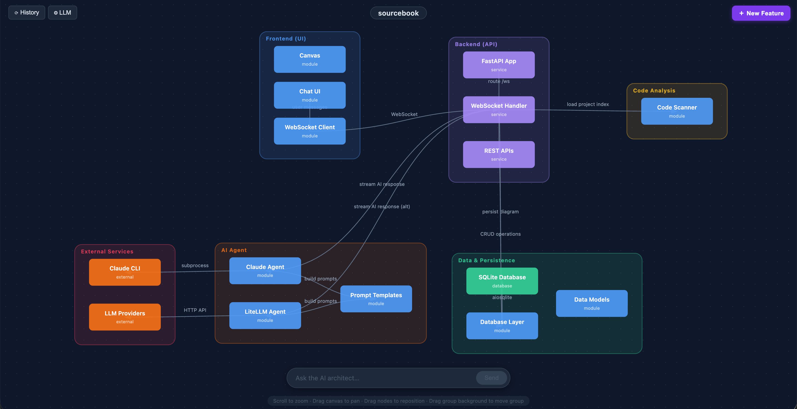
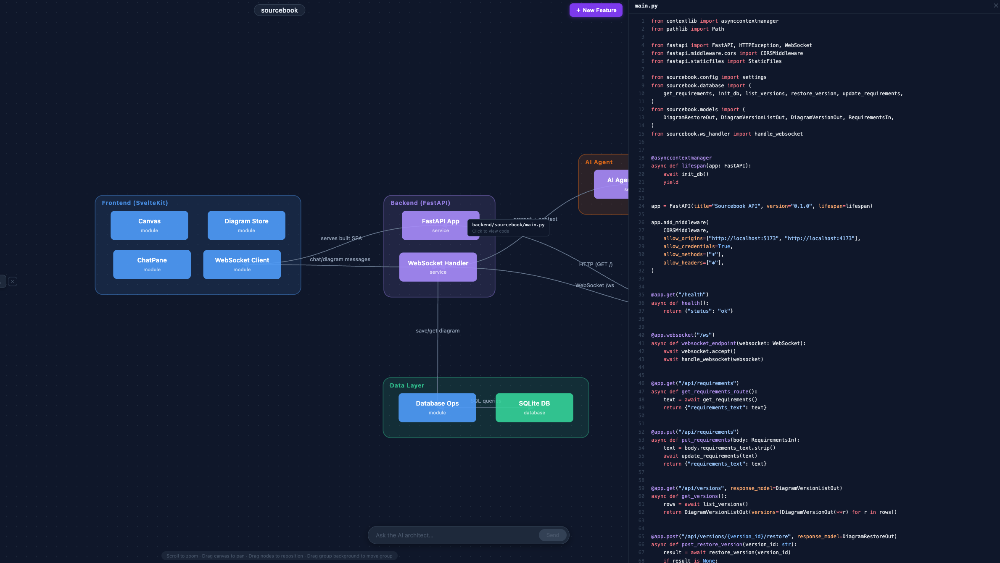

# Sourcebook

Sourcebook is an **architecture-first development tool** that flips the traditional coding workflow. Instead of writing code and reverse-engineering documentation from it, you **design your system visually first** — then an AI coding agent uses that diagram as its implementation spec.

---

## Why Sourcebook?

In the era of AI-augmented development, the primary cognitive task of an engineer has shifted. The bottleneck is no longer how fast we can type, but how fast we can comprehend.

---

### 🧠 The Challenge: Cognitive Overload
AI agents can generate large, complex segments of code in seconds. This speed often creates a "transactional" experience where developers move from task to task without truly internalizing the design decisions or the problem space. We are losing the opportunity to truly "inhabit" the systems we build.

> **The Sourcebook Fix: Separate Architecture from Implementation**
> Sourcebook forces a strategic pause. By mapping out data flows and structural design *before* the first prompt, you reclaim ownership of the system architecture before automating the syntax. Architecture as Code!

### 🏚️ The Challenge: Documentation Decay
We’ve been trained not to trust comments. Outdated READMEs, stale TODOs, and comments that contradict the code are the norm. The "real" documentation is the code itself, but AI-generated code is often too dense to parse quickly, creating a disconnect between design and reality.

> **The Sourcebook Fix: Documentation as a Living System**
> Sourcebook turns your codebase into a single source of truth for both humans and AI. It generates a "living" visual architecture that evolves with your code. When the system changes, the map updates—ensuring your mental model (and your AI’s context) is always accurate.

### 🪙 The Challenge: The "Token Tax"
AI-assisted coding is expensive—not just in dollars, but in the time lost to "hallucination loops." Feeding an AI thousands of lines of raw code just to "figure out the architecture" is a massive waste of context window and token budget.

> **The Sourcebook Fix: Precision Context**
> By providing a clear implementation spec derived from a visual architecture, you give the AI a surgical strike zone. This reduces iterations, minimizes errors, and allows you to strategically allocate your "token budget" to the parts of the system that actually need it.


---

## What It Is

- **Visual canvas** — a pannable, zoomable SVG diagram where nodes are modules/components/services and edges are dependencies, data flow, or API calls.
- **AI chat pane** — a sidebar connected to Claude (via the Claude Code CLI). The agent has full context of your diagram and can generate, refactor, or explain code.
- **Diagram-as-prompt** — the serialized canvas state is the primary context sent to the AI. Architecture-driven generation, not vibes-driven generation.
- **Living documentation** — static analysis (Tree-sitter) keeps the diagram in sync with real code. Drift is visible, not hidden.
- **Human override system** — manually correct any AI-inferred element. Overrides persist as ground truth and survive future re-parses.

---

## Demo

Sourcebook lives in the codebase after running `sourcebook scan` under hidden directory `.sourcebook`.

Scanning will show the architecture overview of the codebase:



Ask AI to gain an overview of a flow:


Investigate code directly in the canvas:




---

## Getting Started

### Prerequisites

| Requirement | Version |
|---|---|
| Node.js | 20+ |
| Python | 3.11+ |
| Claude Code CLI | latest (`claude --version` must work) |

Sourcebook uses the `claude` CLI subprocess for AI — **no API key required**. It reuses the auth from your existing Claude Code installation.

### Install

```bash
curl -fsSL https://raw.githubusercontent.com/joxtoyod/sourcebook/main/install.sh | bash
```

For smoother installation and ensuring the path is correctly setup, I recommend installing [pipx](https://pipx.pypa.io/) prior to running the bash command 

This clones the repo, builds the frontend, and installs the `sourcebook` CLI globally. Run it again to update.

**Prerequisites**: Python 3.11+, Node.js 20+, and [Claude Code CLI](https://claude.ai/download).

#### Manual install (for development)

```bash
git clone https://github.com/joxtoyod/sourcebook.git
cd sourcebook
make install
```

### Run

```bash
# From any project directory:
sourcebook          # start the UI
sourcebook scan     # scan codebase and generate diagram
```

The `sourcebook` command starts the FastAPI backend and opens the UI in your browser. Everything runs on **one port** — no proxy, no separate processes.

---

## Development Commands

| Command | Description |
|---|---|
| `make install` | Install all frontend and backend dependencies |
| `make dev` | Build frontend + start backend with hot reload on `:8000` |
| `make start` | Build frontend + start backend (production mode) |
| `make build` | Build frontend only → outputs to `backend/static/` |
| `npm run check` *(in `frontend/`)* | Svelte type checking |
| `npm run lint` *(in `frontend/`)* | ESLint + Prettier |
| `pytest` *(in `backend/`)* | Run backend tests |
| `ruff check .` *(in `backend/`)* | Lint Python |
| `ruff format .` *(in `backend/`)* | Format Python |

---

## Configuration

Create a `backend/.env` file to override defaults (all optional):

```env
DB_PATH=sourcebook.db
CLAUDE_BIN=/usr/local/bin/claude   # only if claude is not in PATH
CLAUDE_MODEL=claude-sonnet-4-5     # override the default model
```

---

## Architecture

```
Browser → http://localhost:8000
               │
         [FastAPI :8000]
           ├── GET  /         → serves built SvelteKit SPA (backend/static/)
           ├── GET  /health   → health check
           ├── WS   /ws/{id}  → WebSocket handler (streaming AI + diagram updates)
           ├── AI Agent       → claude CLI subprocess (stream-json output)
           ├── Scanner        → Tree-sitter static analysis (code → diagram sync)
           └── SQLite         → diagram layout, overrides, history
```

### Tech Stack

| Layer | Technology                          |
|---|-------------------------------------|
| Frontend | SvelteKit (TypeScript)              |
| Backend | Python FastAPI                      |
| AI | Claude via `claude` Agent SDK       |
| Real-time | WebSocket (bidirectional streaming) |
| Canvas | Custom SVG renderer                 |
| Code analysis | Tree-sitter (multi-language)        |
| Database | SQLite (local persistence)          |

---

## How It Works

1. **Design** — Open the canvas. Lay out modules, services, data models, and their relationships. Use the AI chat to propose or refine the architecture from a description.
2. **Refine** — The AI generates a detailed diagram. Review, adjust, and approve. Each node and edge becomes a structured spec.
3. **Implement** — Trigger the AI coding agent to generate code module-by-module, using the diagram as its authoritative context.
4. **Sync** — As code evolves, Sourcebook re-parses the source and updates the diagram. Drift surfaces. Human overrides persist.

---

## Contributing

Contributions are welcome. Please open an issue first to discuss significant changes.

```bash
# After making changes
npm run lint        # in frontend/
ruff check .        # in backend/
pytest              # in backend/
```

---

## License

MIT — see [LICENSE](./LICENSE).
